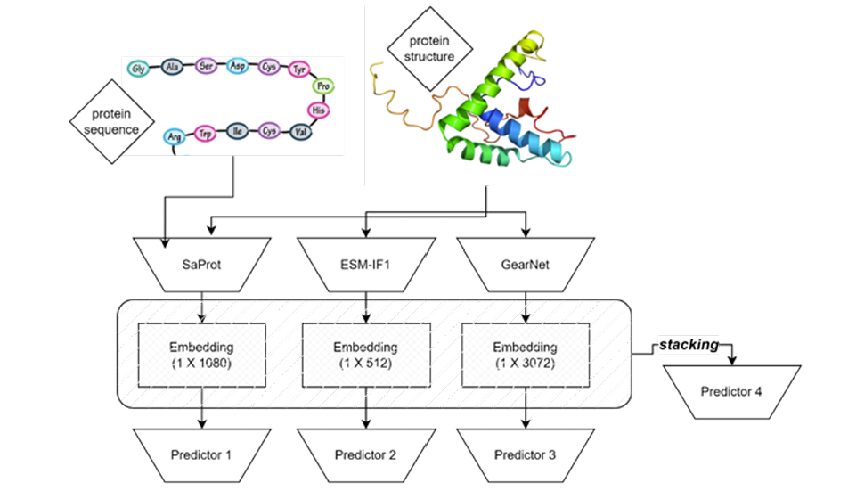
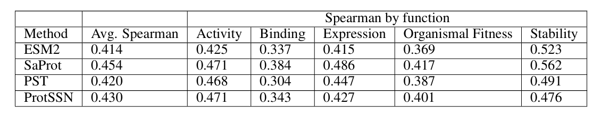
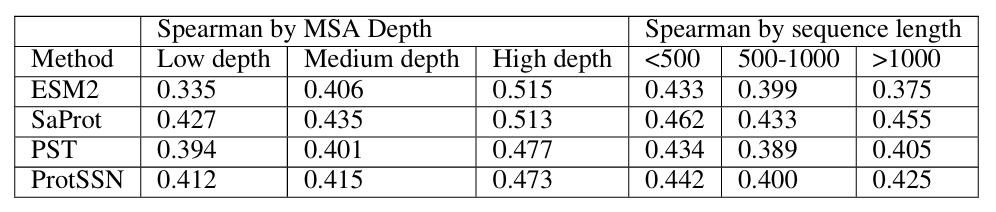
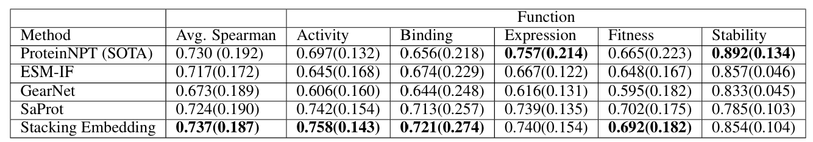

# MEP-SiPLM

Protein mutation effect prediction using structure information and protein
language models, with preprocessing, training, and benchmarking utilities.

## Block Diagram


## Results
### Table 1: Average and Function Specified Spearman Score for different models


### Table 2: Spearman Score by different MSA Depth and sequence length


### Table 3: Average and Function Specified Spearman for different trained predictors (standard deviation in the parentheses)


## Repository Structure
```
benchmark/   Scripts to evaluate baseline or prior models
data/        Dataset preprocessing and analysis notebooks
supervised/  Supervised training and evaluation code
```

## Prerequisites
- Python (conda recommended)
- PyTorch
- pandas
- numpy
- ESM

## Installation
```
git clone https://github.com/yxliu-TAMU/MEP-SiPLM
```

## Dataset
Download the dataset from Zenodo:
https://zenodo.org/records/10951915

## Notes
- Some proteins have mismatched sequence/structure entries and were skipped.
- Some sequences contain multi-mutation entries and were skipped.
